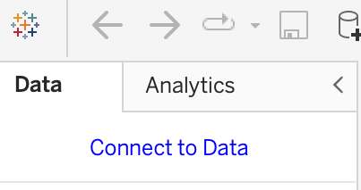

# Tableau Worksheets

## Introduction
Now that you have learned of the many features of Tableau, it is time to put that knowledge to work and create your first worksheet. To begin this lesson, you should have already downloaded and installed a version of Tableau Public (or Desktop if you chose). You will follow the instructions in this lesson using your version of Tableau to create and publish a basic worksheet.

## Objectives
You will be able to: 
* Load a data set into Tableau
* Create a basic worksheet
* Change the style of visualization
* Add title and descriptive information to the visualization
* Save and publish the worksheet to Tableau Public


## Loading Data

Before you begin this lesson, you will need to download the dataset from the lesson repository. Click on the following link and save it in a location you will be able to find.  
<a href="link to dataset.something">Superstore.xlsx</a>  
> When you installed Tableau, a folder was created in your _Documents_ folder called __'My Tableau Repository'__, this is a good location to save your data for easy access. Also, this data set is avaliable for download directly through Tableau Public, but it is updated frequently, so to ensure you are getting the correct results you should be using the file linked above.

We will begin this lesson by opening your version of Tableau on your desktop. When opening a new notebook, you will see the highlighted text _Connect to Data_ in the __Data__ pane.   
  
To load a dataset, you will need to click on this text to chose your data source. Once you click on this text a dialogue box will open with the various locations and formats data is avaliable.  For this lesson you will be using the __superstore.xlsx__ data set. To chose this dataset, you will need to navigate to the folder where you saved it at the time of download. During installation, Tableau will have created a folder in your documents file titled 'My Tableau Repository.' The 

We are using data from one table, but if you were importing data which contained multiple tables, you would need to specify which tables you want to work with by dragging them to the workspace, the blank area to the right of the data pane. Your data should have ended up in the workspace automatically since we are working with only one table. 

You can practice adding and removing data from the workspace by clicking and dragging the data from the workspace into the data pane and vice versa. Be sure you have it in the workspace before moving on. You should see a preview table at the bottom with your data in it and a list of the fields present in the table.

Next we will open a new worksheet by selecting the default worksheet in the tab at the bottom of the page. The default sheet is likely named __"Sheet1"__ or something similar.

## Adding data to the worksheet

Now we will get a look at what Tableau can do. Click and drag a __{ENTER A DIMENSION HERE})__ to the _columns_ shelf and a __{ENTER A MEASURE HERE}__. Once you have these two elements in place, you should see a default graph shown for this data. Take some time and movet the data around to get a feel for how Tableau will render different measures. This is a good opportunity to use the _swap axes_ button in the tool bar. It looks like this:


You can change the type of visualization that is rendered with the __Show Me__ menu in the upper right hand corner.  If you click on this menu, you will see a selection of visualizations that are avaliable. The specific visualizations which can be rendered with the data you have dragged into the workspace will be highlighted and the others will be diffused in color. You will also notice at the bottom of the show me menu, there are tips for which data types would be necessary to generate the selected graph. Try changing the data that you have placed in the workspace and look at the different types of graphs avaliable for the different data types. 

## Topic Title 3


```python
## content for topic title 3
```

## Summary
Summary goes here
